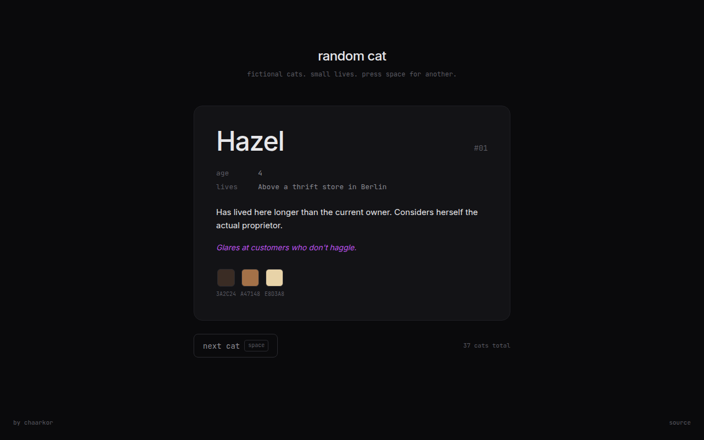

# random cat

> Fictional cats living small lives across Europe. Press a button, get a cat.



A small single-page generator. Each cat has a name, an age, a location, two sentences of quietly disappointed biography, and a color palette that vaguely matches their fur.

No purpose. No backend. No API. Just 42 cats.

## why this exists

To farm a GitHub achievement badge. ⭐ would be appreciated.

Also as an exercise in restraint: every cat is hand-written, the tone stays deadpan, and the palette never gets cute.

## stack

- Astro 6
- React 19 (hydrated only on the card itself)
- Tailwind 4
- Inter + JetBrains Mono

## run it locally

```bash
pnpm install
pnpm dev
```

Then open `http://localhost:7203`. Press space for another cat.

## the cats

A non-exhaustive sample of who lives in here:

- **Hazel**, 4 — above a thrift store in Berlin. Glares at customers who don't haggle.
- **Marcus**, 11 — has been quietly depressed since 2019. Maintains it's nothing personal.
- **Otto**, 13 — lives in a retirement home in Hamburg. Not officially a resident.
- **Magda**, 10 — found in a stairwell in 2016. Sits on exactly one tile in the kitchen.

42 in total. They are not based on anyone's real cat, and any resemblance to your cat is your problem.

## license

MIT. Take the cats. Make more cats. Make them sadder.
